# Sensors Library  

This library implements drivers various sensors, including:

1. IMUs (Inertial Management Units), that is combined gyroscopes and accelerometers.
2. Barometers

## IMUs

The following IMUs are currently implemented:

| IMU                                                                                        | ID          | SPI      | I2C      |
| -------------------------------------------------------------------------------------------| ----------- | ---------| -------- |
| Bosch [BMI270](https://www.bosch-sensortec.com/products/motion-sensors/imus/bmi270/)       | BMI270      | untested | working  |
| CEVA [BNO085](https://www.ceva-ip.com/product/bno-9-axis-imu/)                             | BNO085      | untested | working  |
| TDK [ICM-20602](https://invensense.tdk.com/products/motion-tracking/6-axis/icm-20602/)     | ICM420602   | untested | untested |
| TDK [ICM-42605](https://invensense.tdk.com/products/motion-tracking/6-axis/icm-42605/)     | ICM426xx    | untested | untested |
| TDK [ICM-42688-P](https://invensense.tdk.com/products/motion-tracking/6-axis/icm-42688-p/) | ICM426xx    | working  | untested |
| TDK [MPU-6000](https://product.tdk.com/en/search/sensor/mortion-inertial/imu/info?part_no=MPU-6000) | MPU6000 | untested | untested |
| ST [ISM330DHCX](https://www.st.com/en/mems-and-sensors/ism330dhcx.html)                    | ISM330DHCX  | working  | working  |
| ST [LSM6DS3TR-C](https://www.st.com/en/mems-and-sensors/lsm6ds3tr-c.html)                  | LSM6DS3TR_C | working  | working  |
| ST [LSM6DSOX](https://www.st.com/en/mems-and-sensors/lsm6dsox.html)                        | LSM6DSOX    | working  | working  |
| InvenSense MPU-6886                                                                        | MPU6886     | untested | working  |
| M5Stack Unified                                                                            | N/A         | N/A      | working  |

The ICM-42605 and ICM-42688 are broadly compatible and share the same driver.

The LSM6DS3TR-C, ISM330DHCX, and LSM6DSOX are broadly compatible and share the same driver.

The MPU-6886 is an IMU that is used by M5Stack devices, it does not seem to be used anywhere else.

## Barometers

The following barometers are currently implemented:

| Barometers                                                                                                     | ID          | SPI      | I2C      |
| ---------------------------------------------------------------------------------------------------------------| ----------- | ---------| -------- |
| Bosch [BMP280](https://www.bosch-sensortec.com/media/boschsensortec/downloads/datasheets/bst-bmp280-ds001.pdf) | BMP280      | untested | untested |

## SPI Build Flags

By default the drivers are configured to us I2C. To use SPI, define the `LIBRARY_SENSORS_IMU_USE_SPI_BUS`. This can be done in the `build_flags` section of `platformio.ini`.

## Frameworks

The Arduino Framework and the Raspberry Pi Pico SDK Framework are supported.

The ESPIDF Framework is currently supported for SPI but not I2C.

Support for the STM32 Framework is under development.

## Dependencies

This library uses the [VectorQuaternionMatrix library](https://github.com/martinbudden/Library-VectorQuaternionMatrix)
for its `xyz_t`(3D vector) and `Quaternion` classes.

## Simplified class diagram

`BUS_SPI` and `BUS_I2C` are statically (build-time) polymorphic, not dynamically (run-time) polymorphic. 
They have functions that have the same names and signatures, but these functions are not virtual. 
This is deliberate. 
This means the SPI and I2C read and write functions can be called directly, rather than indirectly via a virtual function pointer.
Some of these functions are short enough that they may be inlined. So in some cases an indirect function call is replaced by an
inlined function. This is important because many of these functions are highly time critical. 
It does result in an unconventional class tree: each concrete IMU class has two pointers to its bus: a pointer to `BUS_BASE` in `IMU_BASE`
and a reference to either `BUS_I2C` or `BUS_SPI` in the class itself.

`ImuBno085` is shown using `I2C_BUS`. It can be configured by a build flag to use `SPI_BUS`.

`ImuBmi270`, `ImuLsmds63trC`, and `ImuIcm426xx` are shown using `SPI_BUS`. They can be configured by build flags to use `I2C_BUS`.

```mermaid
classDiagram
    class BUS_BASE {
        _deviceRegister uint8_t
        _device_read_buf uint8_t*
        _device_read_length size_t
        WAIT_DATA_READY() int32_t
        WAIT_DATA_READY(uint32_t ticksToWait) int32_t
        SIGNAL_DATA_READY_FROM_ISR()
    }

    ImuBase <|-- ImuM5Unified
    class ImuM5Unified {
        read_gyro_raw() xyz_int32_t override
        read_acc_raw() xyz_int32_t override

        read_gyro_rps() xyz_t override
        read_gyro_dps() xyz_t override
        read_acc() xyz_t override
        read_acc_gyro_rps() acc_gyro_rps_t override
    }
    ImuM5Unified *-- BUS_I2C

    ImuBase <|-- ImuMpu6886
    class ImuMpu6886 {
        set_interrupt_driven() override
        setGyro_offset(const xyz_int32_t& gyro_offset) override

        read_gyro_raw() xyz_int32_t override
        read_acc_raw() xyz_int32_t override

        read_gyro_rps() xyz_t override
        read_gyro_dps() xyz_t override
        read_acc() xyz_t override
        read_acc_gyro_rps() acc_gyro_rps_t override
        get_acc_gyro_rps() acc_gyro_rps_t override
    }
    ImuMpu6886 *-- BUS_I2C

    ImuBase <|-- ImuBno085
    class ImuBno085 {
        read_gyro_raw() xyz_int32_t override
        read_acc_raw() xyz_int32_t override
        read_gyro_rps() xyz_t override
        read_orientation() Quaternion override
    }
    ImuBno085 *-- BUS_I2C

    BUS_BASE <|-- BUS_I2C
    class BUS_I2C {
        _i2c_index i2c_index_e
        _pins pins_t
        _i2c_address uint8_t

        set_interrupt_driven()
        set_device_data_register(uint8_t deviceRegister, uint8_t* read_buf, size_t read_length)

        read_device_data() bool
        read_register(uint8_t reg) uint8_t
        read_register_with_timeout(uint8_t reg, uint32_t timeout_ms) uint8_t
        read_register(uint8_t reg, uint8_t* data, size_t length) bool
        read_bytes(uint8_t* data, size_t length) bool
        read_bytes_with_timeout(uint8_t* data, size_t length, uint32_t timeout_ms) bool
        write_register(uint8_t reg, uint8_t data) uint8_t
        write_register(uint8_t reg, const uint8_t* data, size_t length) uint8_t
        write_bytes(const uint8_t* data, size_t length) uint8_t
    }

    BUS_BASE <|-- BUS_SPI
    class BUS_SPI {
        _spi_index spi_index_e
        _pins pins_t

        set_interrupt_driven()
        set_device_data_register(uint8_t deviceRegister, uint8_t* read_buf, size_t read_length)

        read_device_data() bool
        read_register(uint8_t reg) uint8_t
        read_register_with_timeout(uint8_t reg, uint32_t timeout_ms) uint8_t
        read_register(uint8_t reg, uint8_t* data, size_t length) bool
        read_bytes(uint8_t* data, size_t length) bool
        read_bytes_with_timeout(uint8_t* data, size_t length, uint32_t timeout_ms) bool
        write_register(uint8_t reg, uint8_t data) uint8_t
        write_register(uint8_t reg, const uint8_t* data, size_t length) uint8_t
        write_bytes(const uint8_t* data, size_t length) uint8_t
    }

    class ImuBase {
        <<abstract>>
        _axis_order axis_order_e
        _gyro_resolution_rps float
        _gyro_resolution_dps float
        _acc_resolution float
        _gyro_sample_rate_hz uint32_t
        _acc_sample_rate_hz uint32_t
        _gyro_offset xyz_int32_t
        _acc_offset xyz_int32_t
        WAIT_IMU_DATA_READY() int32_t
        WAIT_IMU_DATA_READY(uint32_t ticksToWait) int32_t

        read_gyro_raw() xyz_int32_t  *
        read_acc_raw() xyz_int32_t *

        virtual init()
        virtual set_interrupt_driven()
        virtual get_gyro_offset() xyz_int32_t
        virtual setGyro_offset()
        virtual get_acc_offset() xyz_int32_t
        virtual setAcc_offset()

        virtual get_acc_one_g_raw() int32_t

        virtual read_gyro_rps() xyz_t
        virtual read_gyro_dps() xyz_t
        virtual read_acc() xyz_t
        virtual read_acc_gyro_rps() acc_gyro_rps_t
        virtual get_acc_gyro_rps() acc_gyro_rps_t

        virtual read_orientation() Quaternion
    }
    ImuBase *-- BUS_BASE

    ImuBase <|-- ImuBmi270
    class ImuBmi270 {
        set_interrupt_driven() override

        read_gyro_raw() xyz_int32_t override
        read_acc_raw() xyz_int32_t override

        read_gyro_rps() xyz_t override
        read_gyro_dps() xyz_t override
        read_acc() xyz_t override
        read_acc_gyro_rps() acc_gyro_rps_t override
        get_acc_gyro_rps() acc_gyro_rps_t override
    }
    ImuBmi270 *-- BUS_SPI

    ImuBase <|-- ImuLsmds63trC
    class ImuLsmds63trC {
        set_interrupt_driven() override

        read_gyro_raw() xyz_int32_t override
        read_acc_raw() xyz_int32_t override
        read_acc_gyro_rps() acc_gyro_rps_t override
        get_acc_gyro_rps() acc_gyro_rps_t override
    }
    ImuLsmds63trC *-- BUS_SPI

    ImuBase <|-- ImuIcm426xx
    class ImuIcm426xx {
        set_interrupt_driven() override

        read_gyro_raw() xyz_int32_t override
        read_acc_raw() xyz_int32_t override

        read_gyro_rps() xyz_t override
        read_gyro_dps() xyz_t override
        read_acc() xyz_t override
        read_acc_gyro_rps() acc_gyro_rps_t override
        get_acc_gyro_rps() acc_gyro_rps_t override
    }
    ImuIcm426xx *-- BUS_SPI
```

